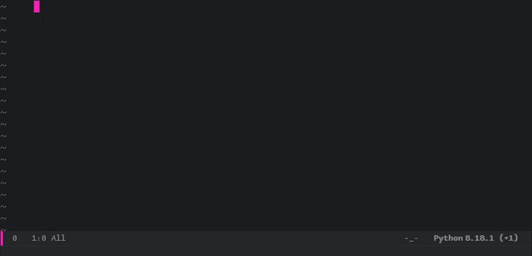

<div align="center">


<h1>codepilot.el</h1>

_AI-powered code completion for emacs_

</div>

Codepilot.el provides AI-based code completion for emacs in a similar way to [copilot.el](https://github.com/copilot-emacs/copilot.el) and GitHub Copilot but with open-source language models.

<div align="center">



</div>


## Getting started

### Example configuration

<details>
<summary><b>straight.el</b></summary>

```elisp
(use-package codepilot
  :straight (:host github :repo "ludvb/codepilot.el" :files ("*.el") )
  :hook ((prog-mode . codepilot-mode)
         (text-mode . codepilot-mode))

  :bind (:map evil-insert-state-map
              ("M-j" . 'codepilot-accept-line)
              ("M-l" . 'codepilot-accept-char)
              ("M-w" . 'codepilot-accept-word)
              ("M-<return>" . 'codepilot-accept-all)
              ("M-J" . 'codepilot-complete-next)
              ("M-K" . 'codepilot-complete-previous))

  :config
  ;; For llama.cpp backend:
  (require 'codepilot-llamacpp)
  (setq codepilot-backend 'llamacpp)
  (setq codepilot-llamacpp-hostname "localhost")
  (setq codepilot-llamacpp-port 8080)

  ;; For Ollama backend:
  (require 'codepilot-ollama)
  (setq codepilot-backend 'ollama)
  (setq codepilot-ollama-hostname "localhost")
  (setq codepilot-ollama-port 11434)
  ;; Optionally, start Ollama server from emacs:
  (require 'codepilot-ollama-server)
  (codepilot-ollama-start))
```

</details>

<details>
<summary><b>Doom Emacs</b></summary>

```elisp
;; packages.el
(package! codepilot
  :recipe (:host github :repo "ludvb/codepilot.el" :files ("*.el")))
```

```elisp
;; config.el
(use-package! codepilot
  :hook ((prog-mode . codepilot-mode)
         (text-mode . codepilot-mode))

  :bind (:map evil-insert-state-map
              ("M-j" . 'codepilot-accept-line)
              ("M-l" . 'codepilot-accept-char)
              ("M-w" . 'codepilot-accept-word)
              ("M-<return>" . 'codepilot-accept-all)
              ("M-J" . 'codepilot-complete-next)
              ("M-K" . 'codepilot-complete-previous))

  :config
  ;; For llama.cpp backend:
  (require 'codepilot-llamacpp)
  (setq codepilot-backend 'llamacpp)
  (setq codepilot-llamacpp-hostname "localhost")
  (setq codepilot-llamacpp-port 8080)

  ;; For Ollama backend:
  (require 'codepilot-ollama)
  (setq codepilot-backend 'ollama)
  (setq codepilot-ollama-hostname "localhost")
  (setq codepilot-ollama-port 11434)
  ;; Optionally, start Ollama server from emacs:
  (require 'codepilot-ollama-server)
  (codepilot-ollama-start))
```

</details>


### Backends

Codepilot.el requires one of the following backends, which needs to be installed separately:

<details>
<summary><b>llama.cpp</b></summary>

Requirements:

- [llama.cpp](https://github.com/ggerganov/llama.cpp) or a wrapper, such as [llama-cpp-python](https://github.com/abetlen/llama-cpp-python)
- [cURL](https://curl.se/)

The default prompt is designed for the [DeepSeek Coder base](https://deepseekcoder.github.io/) models, which can be found on [Hugging Face](https://huggingface.co/models?other=deepseek&sort=trending&search=base+gguf).
If you are using another model, you may need to customize `codepilot-prompt-fun` and `codepilot-postprocess-fun`.

</details>

<details>
<summary><b>Ollama</b></summary>

Requirements:

- [Ollama](https://github.com/jmorganca/ollama)
- [cURL](https://curl.se/)

By default, the Ollama backend uses the [`deepseek-coder:6.7b-base`](https://deepseekcoder.github.io/) model, which needs to be pulled before use by running
```sh
ollama pull deepseek-coder:6.7b-base
```
To use another model, customize `codepilot-ollama-model`.
You may also need to customize `codepilot-prompt-fun` and `codepilot-postprocess-fun` as needed.

</details>


## Contributing

Contributions are always welcome!
Feel free to open an issue if you have found a bug or have a feature request, or submit a PR that implements a proposed change.
